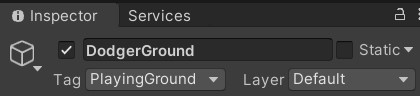
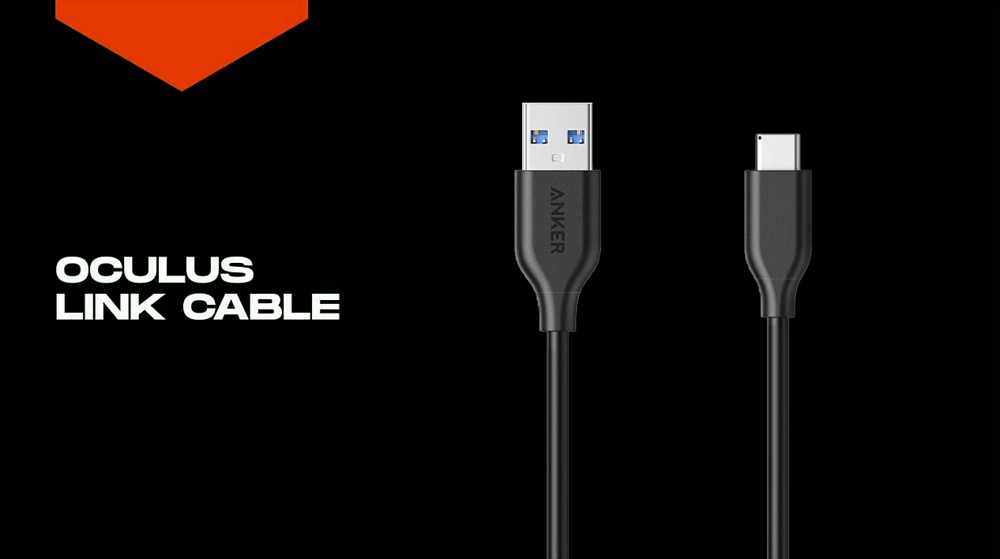

# VR Trefbal Handleiding

| Naam | Studentnummer |
| ---- | ------------- |
| Collette Cédric | s107601 |
| Van Nueten Wouter | s107229 |
| Rahimi Halima | s101035 |
| Chauvaux Nico | |
| Messiaen Ruben | |

## Inleiding

Voor het vak VR Experience hebben wij als project gekozen om een VR Trefbal spel te maken. Bij dit spel is het de bedoeling dat de speler drie ontwijkers probeert te raken met een bal. Deze ontwijkers zijn AI's die we getraind hebben voor dit project.

## Samenvatting

Met deze handleiding geven wij stap voor stap uitleg hoe men van een leeg Unity project kan bekomen aan ons VR Trefbal spel. Er zal uitgelegd worden welke spelobjecten wij hebben aangemaakt, hoe deze zich kunnen gedragen in de spel omgeving en welke andere installaties er benodigd zijn.

## Methoden

### Installaties

Voor het spel werkende krijgen zijn er verschillende installaties vereist:

- Unity: 2019.4.10f1
- ML-Agents: 0.21.1
- Unity Oculus XR Plugin: 1.4.3
- Anaconda: 4.8.3

### Spelverloop

Bij het eerst inladen van de VR omgeving zal de speler zich bevinden in een sportzaal op een speelveld. De speler zal gecentreerd op een helft van dat speelveld staan. Aan de andere kant van het speelveld bevinden zich drie rode pion achtige firguren. Dit zijn de ontwijkers.

Het doel van het spel is dat de speler de ontwijkers uit schakelt met behulp van een ongelimiteerde hoeveelheid ballen die de speler kan gooien. Zolang de bal de ontwijker eerst raakt zal de ontwijker zijn uit geschakelt. Als de bal de grond eerst raakt en dan pas tegen de ontwijker telt dit dus niet mee. De ontwijkers zullen actief deze ballen proberen ontwijken. Zij hebben in tegenstelling tot de speler wel de vrijheid om zich te verplaatsen op hun zijde van het speelveld.

Tijdens het spel zullen er "power-ups" tevoorschijn komen. Deze power-ups bevinden zich op willekeurige plekken boven het veld. Als de speler een power-up kan raken door er een bal tegen te gooien zal die power-up voor een gelimiteerde tijd geactiveerd worden. Dat zorgt er dan voor dat de ballen die speler kan gooien groter zijn dan normaal. Hierdoor zal het dus makkelijker zijn om de ontwijkers te raken.

Het spel duurt maximaal 120 seconden. Als de speler binnen deze tijd de drie ontwijkers krijgt uitgeschakelt is het spel gewonnen. Als de tijd op is voor alle ontwijkers zijn uitgeschakelt is het spel verloren en moet de speler opnieuw beginnen.

### Observaties, acties en beloningen

#### Observaties

De ontwijker kan verscheidene dingen observeren in het speelveld. Dit zijn de verschillende observaties die de ontwijker kan hebben:

- PlayingGround: Het deel van het speelveld waar de ontwijkers op moeten blijven.
- Player: De ontwijker kan de speler zien, zodat hij weet waar de ballen vandaan komen.
- Ball: De ontwijker kan de ballen zien aankomen, waardoor hij deze kan ontwijken.
- Dodger: De ontwijkers kunnen ook elkaar zien, zodat ze kunnen vermijden dat ze tegen elkaar oplopen.
- Ground: De ontwijkers kunnen de grond zien van de rest van het veld dat geen speelveld is, zodat ze kunnen vermijden daarop te lopen.

Dit zijn eveneens de tags die de andere gameobjecten bevatten zodat de ontwijker ze kan herkennen.

#### Acties

De ontwijker kan rondbewegen en springen, zodat hij de bal kan ontwijken. De speler zelf kan niet bewegen, maar kan wel de bal gooien naar de ontwijkers. De speler kan ook de bal gooien naar de power-ups om zo grotere ballen te krijgen.

#### Beloningen

De ontwijker krijgt verscheidene beloningen en straffen voor de acties die hij onderneemt tijdens het spelverloop:

- Geraakt door bal: - 0.5
- Op het speelveld: + 0.01
- Buiten het speelveld van de ontwijkers: - 0.5


### Beschrijving en opbouw objecten

#### Omgeving


De spelomgeving is een zaal met tribunes en toeschouwers. De toeschouwers hebben geen invloed op het spel. Alleen de grond (rood), speelveld (groen) en de middenlijn die het speelveld verdeelt in twee delen (wit) zijn van belang voor de ontwijker. De zaal zijn vier Panes die een rode material bevatten. Er zijn ook acht capsules aanwezig die een spotlight hebben om de zaal te verlichten. Het speelveld bestaat uit twee aparte platte Cubes. De tribunes zijn opgebouwd uit verscheidene Cubes die op elkaar gestapeld zijn en de toeschouwers zijn groene Spheres met twee paar witte en zwarte Spheres die ogen vormen. Ook is er een onzichtbare Cube Box Collider die ervoor zorgt dat de power-ups binnen zijn grenzen kan spawnen. De deuren en tekst op de muur zijn optioneel.

Het eerste wat men moet doen is het maken van een environment script:

1. Selecteer het speelveld in dit geval zal dit de Gym zijn.
2. In de inspector klikt men op `Add Component`.
3. In de components lijst klikt men op `New Script` (dit bevindt zich onder aan)
4. geef de script de naam "Environment"
5. dan klikt men op `Create and Add`

laten we nu het script aanpassen. In de Unity Project window dubbel klikt men op `Environment.cs`, dit opent het script in de code editor. We beginnen met enkele object-variabelen toetevoegen.

```cs (Environment.cs)
    public const float MAXTIME = 120f;
    public float ballAverageSpawnTimer = 2f;
    public bool TrainingMode = true;
    public bool ballHasBeenTakenNonTraining;
    public bool powerUpBall = false;
    public GameObject ballPrefab;
    public GameObject dodgerPrefab;
    public GameObject powerUpSpawnLocation;
    public GameObject powerUpPrefab;
    public List<GameObject> powerUpList;
    public List<Dodger> dodgersList;

    private const float POWERUP_SPAWNTIMER = 15f;
    private float episodeTime = MAXTIME;
    private float ballRespawnTime;
    private float currentScore = 0f;
    private float currentUpgradeTimer = POWERUP_SPAWNTIMER;
    private float largeScale = 2f;
    private float largeTimer = 10f;
    private bool throwing = true;
    private bool spawnDodgers;
    private bool spawningPowerups = true;
    private System.Random random = new System.Random();
    private GameObject ballSpawnpointNonTraining;
    private GameObject balls; 
    private GameObject dodgers;
    private Vector3 standardPositionDL;
    private Vector3 standardPositionDM;
    private Vector3 standardPositionDR;
    private TextMeshPro scoreboard;
    private BoxCollider powerUpSpawnBox;
```

We beginnen met enkele publieke object-variabelen.

- `MAXTIME` toont aan hoelang elke episode zal duren.
- `ballAverageSpawnTimer` geeft weer hoelang het duurt voor een bal spawnt
- `TrainingMode` is bedoelt voor het trainen van de ML-agent, wanneer dit op true staat zullen de ballen vanzelf geworpen worden.
- `ballHasBeenTakenNonTraining` zal de speler zelf de bal kunnen oprapen en de mogelijkheid hebben om te hooien.
- `powerUpBall` wordt nagekeken of de bal een power-up heeft geraakt.
- `ballPrefab` komt de prefab object van de bal.
- `dodgerPrefab` komt de prefab object van de dodger.
- `powerUpSpawnLocation` is de locatie waar in de power-ups mogen spawnen.
- `powerUpPrefab` komt de prefab object van de power-up.
- `powerUpList` lijst waar de power-ups in toegevoegd worden.
- `dodgersList` lijst waar de dodgers in toegevoegd worden.

De volgende variablen zijn de private objecten.

- `POWERUP_SPAWNTIMER` geeft aan hoelang het duurt vooralleer een power-up zal spawnen.
- `episodeTime` toont hoelang elke episode zal duren.
- `ballRespawnTime` geeft aan hoelang het duurt vooralleer een bal zal spawnen.
- `currentScore` toont de score.
- `currentUpgradeTimer` zorgt ervoor dat er een timer is tussen het werpen van de bal.
- `largeScale` zorgt ervoor wanneer een bal tegen een power-up komt de bal groter word.
- `largeTimer`zorgt ervoor dat de power-up een bepaalde tijd actief blijft.
- `throwing` is vooral bedoelt voor het trainen van de ML-agent, die zorgt ervoor dat de `ballSpawner` wordt aangeroepen.
- `spawnDodgers` spawnt de dodgers.
- `spawningPowerups` spant de power-ups
- `random` is een variabelen die gebruikt wordt om de random positie van een dodger op te halen.
- `ballSpawnpointNonTraining` wordt de spawn point gekoppeld.
- `balls` wordt de GameObject bal gekoppeld.
- `dodgers` wordt de GameObject dodger gekoppeld.
- `standardPositionDL`, `standardPositionDM`, `standardPositionDR` zijn de spawn posities van de dodegers.
- `scoreboard` geeft de score weer.
- `powerUpSpawnBox` zorgt ervoor dat de power-ups niet buiten het speelveld spawnen.

### initializatie van Environment

In De Start methode gebeurt de initialisatie van enkele bovenstaande referenties en wordt als eerste opgeroepen, voor dat het spel begint wordt deze methode uitgevoerd. In de if statement wordt er gekeken of de bool Training Mode op false staat als dit zo is zullen de ballen niet vanzelf gegooid worden maar moet de speler dit doen. Wat belangrijk is dat de `Find()` en `GetComponentInChildren` op de `transform` van `environment` staat. Dit wordt gedaan omdat we later de omgeving gym gaan dupliceren binnen dezelfde scene om het dan te laten trainen.

```cs (Environment.cs)
void Start()
    {
        if (!TrainingMode)
        {
            ballHasBeenTakenNonTraining = true;
            ballSpawnpointNonTraining = transform.Find("BallSpawnPoint").gameObject;
        }
        balls = transform.Find("Balls").gameObject;
        dodgersList = new List<Dodger>();
        ballRespawnTime = ballAverageSpawnTimer;
        StartCoroutine(PowerUpSpawner());
        StartCoroutine(BallSpawner());
        standardPositionDL = new Vector3(10f, 3f, -20f);
        standardPositionDM = new Vector3(0f, 3f, -20f);
        standardPositionDR = new Vector3(-10f, 3f, -20f);
        SpawnDodgersGameobject();
        SpawnDodgers();
        scoreboard = transform.GetComponentInChildren<TextMeshPro>();
        powerUpSpawnBox = powerUpSpawnLocation.GetComponent<BoxCollider>();
    }
```

De methode `Update()` wordt per frame aangeroepen. Er word gekeken wanneer de bal een power-up raakt. Er wordt ook nagekeken of de boolean `throwing`, `spawningPowerups` en `powerUpList` op false staan.

```cs (Environment.cs)
void Update()
    {
        if (throwing == false)
        {
            StartCoroutine(BallSpawner());
            throwing = true;
        }
        if (spawningPowerups == false && powerUpList.Count() < 3)
        {
            StartCoroutine(PowerUpSpawner());
            spawningPowerups = true;
        }
        if (powerUpBall)
        {
            largeTimer -= Time.deltaTime;
            if (largeTimer <= 0)
            {
                powerUpBall = false;
            }
        }
        if (spawnDodgers)
        {
            SpawnDodgers();
        }
    }
```

In de `FixedUpdate` wordt er gekeken of de `episodeTime` niet verlopen is. Als dit wel het geval is worden alle episodes beëindigd en de environment gereset. Dan wordt er in de if statement naar de `dodgersList` gekeken. Wanneer de `dodgersList` leeg is wordt de `ResetEnvironment` uitgevoerd. Als de lijst niet leeg is wordt er gekeken of één van de dodgers geraakt is door de bal. Als de dodger niet geraakt is wordt de scoreboard geupdate dit gebeurt via de getter van de interne `GetCumulativeReward` variabele op de `Dodger` klasse. Als de dodger wel geraakt is geraakt wordt de `EndEpisode` uitgevoerd, die dodger wordt dan ook destroyed en verwijderd uit de list. Buiten de for loop wordt de score aan de `scoreboard` toegekend.

```cs (Environment.cs)
 void FixedUpdate()
    {
        currentScore = 0f;
        if(episodeTime >= 0)
        {
            if (dodgersList.Count == 0)
            {
                ResetEnvironment();
            }
            else
            {
                for (int counter = dodgersList.Count - 1; counter >= 0; counter--)
                {
                    if (!dodgersList[counter].isHit)
                    {
                        currentScore += dodgersList[counter].GetCumulativeReward();
                    }
                    else if (dodgersList[counter].isHit)
                    {
                        dodgersList[counter].EndEpisode();
                        Destroy(dodgersList[counter].gameObject);
                        dodgersList.Remove(dodgersList[counter]);
                    }
                }
                scoreboard.text = currentScore.ToString("f3") + "\n" + episodeTime.ToString("f0");
            }
            episodeTime = episodeTime - Time.deltaTime;
        } else
        {
            EndAllEpisodes();
            ResetEnvironment();
        }
    }
```

De `SpawnDodgersGameobject` methode spawnd de dodgers elke keer als een episode beëindigd is. De dodgers worden willekeurig in hun speelveld geplatst.

```cs (Environment.cs)
 private void SpawnDodgersGameobject()
    {
        dodgers = new GameObject();
        dodgers.name = "Dodgers";
        dodgers.transform.SetParent(this.transform);
        dodgers.transform.position = this.transform.position;
    }
```

In de `ResetEnvironment` methode word het voledige environment gereset. De power-ups worden verwijderd, de `balls` worden ook leeg gemaakt dit word ook bij de `dodgers` gedaan. de respawn van de dodgers, de `episodeTime` en de `currentUpgradeTimer` worden hier ook gedaan. De booleans `spawnDodgers`, `ballHasBeenTakenNonTraining` worden op true gezet en de `throwing`, `spawningPowerups` worden op false gezet.

```cs (Environment.cs)
 public void ResetEnvironment()
    {
        foreach (GameObject powerUp in powerUpList)
        {
            Destroy(powerUp);
        }
        foreach (Transform ball in balls.transform)
        {
            Destroy(ball.gameObject);
        }
        Destroy(dodgers.gameObject);
        SpawnDodgersGameobject();
        StopAllCoroutines();
        episodeTime = MAXTIME;
        currentUpgradeTimer = POWERUP_SPAWNTIMER;
        spawnDodgers = true;
        throwing = false;
        spawningPowerups = false;
        ballHasBeenTakenNonTraining = true;
    }
```

De `SpawnDodgers` methode zorgt ervoor dat de dodgers terug respawen wanneer de `dodgersList` leeg is en of wanneer de episode eindigt. De drie dodgers worden één per één aangemaakt en aan de list `dodgersList` toegevoegd.

```cs (Environment.cs)
public void SpawnDodgers() 
    {
        GameObject dodgerLeft = Instantiate(dodgerPrefab, transform);
        dodgerLeft.transform.SetParent(dodgers.transform);
        dodgerLeft.transform.localPosition = standardPositionDL;
        dodgerLeft.name = "dodgerLeft";
        GameObject dodgerMiddle = Instantiate(dodgerPrefab, transform);
        dodgerMiddle.transform.SetParent(dodgers.transform);
        dodgerMiddle.transform.localPosition = standardPositionDM;
        dodgerMiddle.name = "dodgerMiddle";
        GameObject dodgerRight = Instantiate(dodgerPrefab, transform);
        dodgerRight.transform.SetParent(dodgers.transform);
        dodgerRight.transform.localPosition = standardPositionDR;
        dodgerRight.name = "dodgerRight";
        dodgersList = transform.GetComponentsInChildren<Dodger>(dodgers).ToList();
        spawnDodgers = false;
    }
```

Voor de methode `BallSpawner` heeft met gekozen voor een `StartCoroutine`, hiermee kan men in de coroutine de code op elk moment pauzeren door gebruik te maken van yield. Hier in wordt de tijd van de ballrespawn om de zoveel seconden aangeroepen. In deze methode worden de spawn van de ballen uitgevoerd samen met de positie van de bal. De ballen krijgen hier ook de richting waar ze naartoe gegooid moeten worden. Door de `randomDodgerPosition` word een willekeurige dodger toegewezen aan de bal.

```cs (Environment.cs)
 IEnumerator BallSpawner()
    {
        while (TrainingMode)
        {
            yield return new WaitForSeconds(ballRespawnTime);
            ballRespawnTime = Random.Range(ballAverageSpawnTimer * 0.5f, ballAverageSpawnTimer * 1.5f);
            GameObject ball = Instantiate(ballPrefab);
            if (powerUpBall == true){
                ball.transform.localScale = new Vector3(largeScale, largeScale, largeScale);
            }
            ball.transform.SetParent(balls.transform);
            float ballX = Random.Range(transform.position.x -1f, transform.position.x + 1f);
            float ballY = Random.Range(transform.position.y + 0.5f,transform.position.y + 3f);
            float ballZ = transform.position.z + 18f;
            Vector3 ballPositie = new Vector3(ballX, ballY, ballZ);
            ball.transform.position = ballPositie;
            Rigidbody ballRigidbody = ball.GetComponent<Rigidbody>();
            int randomDodgerNumber = random.Next(0, dodgersList.Count());
            GameObject randomDodger = dodgersList[randomDodgerNumber].gameObject;
            Vector3 randomDodgerPosition = (randomDodger.transform.position - ball.transform.position).normalized;
            Vector3 throwVector = new Vector3(randomDodgerPosition.x, randomDodgerPosition.y + 0.1f, randomDodgerPosition.z);
            ballRigidbody.velocity = throwVector * 60f;
        }
        while (!TrainingMode)
        {
            if (ballHasBeenTakenNonTraining)
            { 
                SpawnBall();
            }
            yield return new WaitForSeconds(3f);
        }
        throwing = false;
    }
```

De `SpawnBall` methode spawnd de ballen elke keer als een episode beëindigd is.

```cs (Environment.cs)
private void SpawnBall()
    {
        GameObject ball = Instantiate(ballPrefab);
        ball.transform.SetParent(balls.transform);
        ball.transform.position = ballSpawnpointNonTraining.transform.localPosition;
        ballHasBeenTakenNonTraining = false;
    }
```

Voor de `PowerUpSpawner` methode is ook gebruik gemaakt van `StartCoroutine`. Deze keer is het voor het respawnen van de power-ups. De power-ups worden in de list `powerUpList` toegevoegd.

```cs (Environment.cs)
IEnumerator PowerUpSpawner()
    {
        while (powerUpList.Count() < 3)
        {
            yield return new WaitForSeconds(currentUpgradeTimer);
            GameObject largePowerUp = Instantiate(powerUpPrefab);
            largePowerUp.GetComponent<EnlargeBallScript>().MyEnvironment = this;
            powerUpList.Add(largePowerUp);
            largePowerUp.transform.SetParent(GameObject.FindGameObjectWithTag("PowerUpList").transform);
            float powerUpX = Random.Range(powerUpSpawnBox.bounds.min.x, powerUpSpawnBox.bounds.max.x);
            float powerUpY = Random.Range(0.3f, powerUpSpawnBox.bounds.max.y);
            float powerUpZ = Random.Range(powerUpSpawnBox.bounds.min.z, powerUpSpawnBox.bounds.max.z);
            largePowerUp.transform.position = new Vector3(powerUpX, powerUpY, powerUpZ);        
        }
        spawningPowerups = false;
    }
```

Bij de `EndAllEpisodes` methode worden alle episode van elke dodger beëindigd. Als er nog dodger in de lijst `dodgersList` staan worden hun episode ook beëindigd en uit de list verwijderd.

```cs (Environment.cs)
 private void EndAllEpisodes()
    {
        if(dodgersList.Count > 0)
        {
            for (int counter = dodgersList.Count - 1; counter >= 0; counter--)
            {
                dodgersList[counter].EndEpisode();
                if(dodgersList[counter] != null && dodgersList[counter].gameObject != null)
                {
                    Destroy(dodgersList[counter].gameObject);
                }
                dodgersList.RemoveAt(counter);
            }
        }
    }
```

#### Speler


Het speler-gameobject heeft op zich niet veel nut, maar wordt gebruikt bij de trainingen van de AI om zo het niet te laten lijken alsof de ballen uit het niets verschijnen. De speler is een blauwe Capsule met geen speciale eigenschappen.

#### Ontwijker


De ontwijker is het object waarop de AI zal worden toegepast. Deze zal aan de hand van de beschikbare acties, beloningen en observaties zo lang mogelijk proberen te overleven en de ballen te ontwijken.
Deze bestaat uit een Capsule als lichaam met één grote witte Sphere als oog en verschillende kleinere zwarte Spheres als de iris van het oog. De zwarte irissen bevatten RayPerceptions die de andere gameobjecten kan waarnemen. Ook is er een plattere zwarte Sphere die dient als wenkbrauw.

Het volgende script dat moet aangemaakt worden is het Dodger script. Dit is het script dat de ontwijker en dus ook AI zal aansturen.

Dit zijn alle properties die in deze klasse worden gedefinieerd

```cs (Dodger.cs)
    //Movement speed and Rotation
    public float MovingSpeed = 5.0f;
    public float Force = 10.0f;

    //Properties
    private Rigidbody body;
    private bool canJump;
    public bool isHit;
    private bool timePast;
    private bool isOnField;
```

- `MovingSpeed` Bepaalt de snelheid waarin de ontwijker kan lopen.
- `Force` De kracht waarmee de ontwijker kan springen.
- `body` Is van type Rigidbody en wordt bijgehouden zodat er krachten gelijk springen kunnen worden uitgeoefend op het fysieke object in de wereld.
- `canJump` is een vanzelfsprekende boolean.
- `isHit` Een boolean die true is als de dodger geraakt is. Deze property wordt voor de rest niet binnen het dodger script zelf gebruikt maar is wel belanngrijk voor andere scripts. Daarom dat het een public property is.
- `timePast` wordt gebruikt om te bepalen wanneer een dodger reward krijgt en/of van afgenomen wordt.
- `isOnField` geeft aan of de ontwijker in het veld is of niet.

De Initialize methode wordt standaard aangeroepen als de ontwijker wordt gespawned of met andere woorden dus geinitialiseerd.

```cs (Dodger.cs)
public override void Initialize()
    {
        base.Initialize();
        body = GetComponent<Rigidbody>();
        body.centerOfMass = Vector3.zero;
        body.inertiaTensorRotation = Quaternion.identity;
        StartCoroutine(DelayMethode());
        canJump = true;
        isOnField = true;
    }
```

De klasse erft over van de Agent klasse

```cs (Dodger.cs)
public class Dodger : Agent
```

De Agent klasse (base van deze klasse) moet ook geinitialiseerd worden. Daarom is de eerste lijn `base.Initialize()`.
Verder wordt hier de body aangevuld, de coroutine gestart die later wordt toe gelicht en de booleans op de juiste waarden gezet.

De OnActionReceived methode is verantwoordelijk voor bepaalde acties uit te voeren bij bepaalde inputs. Dit wordt door MLAgents gebruikt en de AI kan deze acties aanspreken. Dankzij deze acties kunnen de ontwijkers dus bewegen.

```cs (Dodger.cs)
public override void OnActionReceived(float[] vectorAction)
    {
        //Forward backward
        if (vectorAction[0] != 0)
        {
            Vector3 translation = transform.forward * movingSpeed * (vectorAction[0] * 2 - 3) * Time.deltaTime;
            transform.Translate(translation, Space.World);
        }
        //Move sidewards
        if (vectorAction[1] != 0)
        {
            Vector3 translation = transform.right * movingSpeed * (vectorAction[1] * 2 - 3) * Time.deltaTime;
            transform.Translate(translation, Space.World);
        }
        //Jump
        if (vectorAction[2] != 0)
        {
            Jump();
        }
    }
```

De Heuristic methode geeft de mogelijkheid om de ontwijkers te besturen met zelf bepaalde inputs van het toetsenbord. Wanneer er een input wordt gedetecteerd zullen de acties van de OnActionReceived methode worden uitgevoerd.

```cs (Dodger.cs)
public override void Heuristic(float[] actionsOut)
    {
        //Defined actions
        actionsOut[0] = 0f;
        actionsOut[1] = 0f;
        actionsOut[2] = 0f;

        if (Input.GetKey(KeyCode.Z)) // Move forward
        {
            actionsOut[0] = 2f;
        }
        else if (Input.GetKey(KeyCode.S)) // Move Backwards
        {
            actionsOut[0] = 1f;
        }
        else if (Input.GetKey(KeyCode.Q)) // Move left
        {
            actionsOut[1] = 1f;
        }
        else if (Input.GetKey(KeyCode.D)) // Move Right
        {
            actionsOut[1] = 2f;
        }
        else if (Input.GetKey(KeyCode.Space)) // Jump
        {
            actionsOut[2] = 1f;
        }
    }
```

De spring actie is in een aparte methode zodat die makkelijk van meerdere plekken kan worden aangeroepen

```cs (Dodger.cs)
private void Jump()
    {
        //Make character jump if jump is ready
        if (canJump)
        {
            canJump = false;
            body.AddForce(Vector3.up * force, ForceMode.Impulse);
        }
    }
```

Wanneer de ontwijker een ander object raakt zal deze methode worden aangeroepen. Elk object heeft een tag ingesteld en wanneer de ontwijker iets aanraakt zal er hier worden gecontroleert wat er juist is geraakt en zal er dan correct op gereageerd worden.

```cs (Dodger.cs)
public void OnCollisionEnter(Collision collision)
    {
        if (collision.collider.tag == "PlayingGround")
        {
            isOnField = true;
            canJump = true;
        }
        if(collision.collider.tag == "Ground")
        {
            isOnField = false;
            canJump = true;
        }
        if(collision.gameObject.tag == "Ball")
        {
            AddReward(-0.5f);
            isHit = true;
        }
    }
```

Deze coroutine bepaalt om de hoeveel seconden een reward zal worden gegeven of afgenomen aan de Agent. Hier gaat er on de seconde een boolean op true worden gezet. Deze boolean wordt dan in een andere methode gebruikt om te bepalen of er een reward mag worden gegeven of afgenomen

```cs (Dodger.cs)
 IEnumerator DelayMethode()
    {
        while (true)
        {
            yield return new WaitForSeconds(1);
            timePast = true;
        }
    }
```

De FixedUpdate methode wordt elke seconden aangeroepen. Deze methode bepaalt voor een groot deel welke rewards er toegevoegd mogen worden zolang er genoeg tijd is gepasseerd (besproken in vorige methode).

```cs (Dodger.cs)
private void FixedUpdate()
    {
        //Add reward if dodger is on playing field
        if (timePast)
        {
            if (isOnField)
            {
                AddReward(0.01f);
            } else
            {
                AddReward(-0.5f);
            }
            timePast = false;
        }
        //Destroys dodger if he falls off from environment
        if(transform.position.y < -1)
        {
            Destroy(this.gameObject);
        }
    }
```

#### Bal


De bal is het voorwerp dat de speler kan gooien om de ontwijkers en de power-ups te kunnen raken. De bal is een normale oranje/gele Sphere. Deze bevat ook een geluidsbestand die afspeelt van zodra de bal iets raakt.

Het volgende script dat moet aangemaakt worden is het Ballhit script. Dit is het dat ervoor zorgt dat de bal zijn eigenschappen veranderen en het geluid afspeelt als de bal iets raakt.

```cs (Ballhitscript.cs properties)
    private bool startCount = false;
    private bool hasMoved = false;
    private float counter = 5f;
    private Rigidbody body;
    private Vector3 initialPostion;
    private Environment environment;
```

- `Startcount`: Als deze op "True" staat, begint de timer te lopen om de ball te despawnen.
- `HasMoved`: Als deze op true staat, gaat de gravity op aan, waardoor de bal valt als deze gegooid wordt.
- `Bounter`: De timer die bepaalt na hoeveel tijd de bal despawned.
- `Body`: De body van de bal die andere objecten kan raken
- `InitialPosition`: De positie waarin de bal begint op het veld.
- `Environment`: De environment waarin de bal moet spawnen.

```cs (Ballhitscript.cs )
    void OnCollisionEnter(Collision collision)
    {
        gameObject.GetComponent<AudioSource>().Play();
        startCount = true;
    }
```

De bal maakt een geluid als het iets raakt.

```cs (Ballhitscript.cs update)
void Update()
    {
        if (initialPostion != this.transform.position && !hasMoved)
        {
            hasMoved = true;
            body.useGravity = true;
            environment.ballHasBeenTakenNonTraining = true;
        }
        //Set ball to hazard when the countdown started
        if (startCount == true)
        {
            transform.gameObject.tag = "Hazard";
            counter -= Time.deltaTime;
            //Destroy ball if countdown ended
            if (counter <= 0)
            {
                Destroy(gameObject);
            }
        }
    }
```

De bal krijgt zwaartekracht als hij niet meer op zijn initiële plek is. Als de bal iets heeft geraakt begint de timer te lopen zodat de bal despawned en kan de bal geen ontwijkers meer van het veld verwijderen.

#### Power-up


De power-up zorgt ervoor dat de ballen die gegooid worden gedurende een korte tijd groter worden. Zo heeft de speler meer kans om de ontwijkers te raken. Deze gebruikt de bal prefab samen met een +-vormig gameobject dat bestaat uit twee langwerpige Cubes.

De power-up bevat de twee volgende scripts.

##### EnlargeBall

```cs (EnlargeBall.cs Properties)
public Environment MyEnvironment; 
```

De enige property is de environment waarin de bal zich bevind.

```cs (EnlargeBall.cs OnTriggerEnter)
private void OnTriggerEnter(Collider other)
    {
        if(other.gameObject.tag == "Ball")
        {
            //Delete powerup from powerup list in environment 
            MyEnvironment.powerUpList.Remove(gameObject);
            Destroy(gameObject);
            MyEnvironment.powerUpBall = true;
        }
    }
```

Als de powerup geraakt wordt, wordt deze verwijdert en worden de ballen groter.

##### Rotate Around

```cs (RotateAround.cs)
public Transform target;
    public int speed;
    // Start is called before the first frame update
    void Start()
    {
        if (target == null)
        {
            target = this.gameObject.transform;
        }
    }

    // Update is called once per frame
    void Update()
    {
        transform.RotateAround(target.transform.position, target.transform.up, speed * Time.deltaTime);
    }
}
```

Dit simpel script zorgt ervoor dat een object rond zichzelf kan draaien of rond een object dat wordt meegegeven aan de parameter "target". Met speed kan je bepalen hoe snel het object rond zichzelf draait of rond het opgegeven object.

### Beschrijving gedragingen van de objecten

#### Omgeving gedragingen

Het speelveld zelf zal nergens op reageren of heeft geen acties die het kan ondernemen. Het speelveld en de grond krijgen wel verschillende tags mee zodat de ontwijker tijdens de training afgestraft wordt en zodat de ontwijker tijdens het spel weet waar hij wel en niet mag lopen. De onzichtbare Box Collider krijgt ook een tag waardoor de power-ups binnen deze grenzen spawnen.



#### Speler gedragingen

Het object speler heeft geen gedragingen. De speler zelf in de VR-omgeving gaat de mogelijkheid hebben om de ballen te gooien naar de power-ups en de ontwijkers.

#### Ontwijker gedragingen

Ontwijkers gaan aan de hand van het speelveld en de ballen zich zodanig proberen te manouvreren zodat ze de ballen kunnen ontwijken. Hoe langer ze zichzelf in leven kunnen houden, des te meer punten ze krijgen. Voor de AI krijgt de ontwijker een BehaviourParameters script mee. Voor de acties die de ontwijker kan ondernemen krijgt de ontwijker het Dodger script mee.


#### Bal gedragingen

De bal zorgt ervoor dat de ontwijkers van het speelveld gaan als deze een ontwijker raakt. Ook zorgt de bal ervoor dat de speler de power-ups kan raken zodat deze zijn ballen kan vergroten. Deze bevat dus de BallHit script en een Audio Source.


#### Power-up gedragingen

De power-ups verschijnen aan de kant van het speelveld van de tegenstanders. Deze power-ups verschijnen om de zoveel tijd en er kunnen er maximaal drie tegelijk zich bevinden op het speelveld.


### Informatie one-pager


Dit is de one-pager dat werd opgemaakt voor de aanvang van het project.

### Afwijking one-pager

Er staat in de one-pager dat de AI's niet hetzelfde reward-systeem gaan hebben. Dit is niet meer het geval, de drie AI's delen hetzelfde reward-systeem, zodat ze elkaar niet zouden tegenwerken.

## Training Methode

Om de Ontwijkers te trainen hebben we volgende training configuratie gebruikt.

### Dodger.yaml

```yaml
behaviors:
  Dodger:
    trainer_type: ppo
    max_steps: 5.0e8
    time_horizon: 64
    summary_freq: 10000
    keep_checkpoints: 5
    checkpoint_interval: 50000
    
    hyperparameters:
      batch_size: 32
      buffer_size: 9600
      learning_rate: 3.0e-4
      learning_rate_schedule: constant
      beta: 5.0e-3
      epsilon: 0.2
      lambd: 0.95
      num_epoch: 3

    network_settings:
      num_layers: 2
      hidden_units: 128
      normalize: false
      vis_encoder_type: simple

    reward_signals:
      extrinsic:
        strength: 1.0
        gamma: 0.99
      curiosity:
        strength: 0.02
        gamma: 0.99
        encoding_size: 256
        learning_rate : 1e-3
```

De volgende commando's zijn nodig om de training uit te voeren:

Om de training te starten:

```c
mlagents-learn Dodger.yaml --run-id [Naam van deze training]
```

Om de resultaten in grafieken te zien:

```c
tensorboard --logdir results
```

## Resultaten

Tijdens het trainen van de Agent hebben zijn er trainingen uitgevoerd met verschillende aanpassingen. Het doel is om de agents efficïent en correct te trainen zodat de agents correct werken in het spel.

### Training 1


Bij de eerste training werden al de parameters op de standaardwaarden gebruikt.

__Gedragingen:__

- De Ontwijkers groeperen in een hoek en duwen elkaar van het speelveld.
- De Ontwijkers lopen naar de kant van de werper op het speelveld en kunnen vervolgens niet meer geraakt worden.
- De Ontwijkers kijken niet naar de richting van de werper.

Door deze gedragingen is de Cumulatieve Reward van de dodger zeer inconsistent zoals in de grafiek te zien is. Hieruit werd er besloten dat de omgeving en de Ontwijkers nog niet volledig klaar zijn om te trainen.

### Training 2


__Aanpassingen in deze training:__

- Extra Ray Perception sensoren die naar de grond kijken op de X en Y -as. Hierdoor hebben de Ontwijkers een beter zicht of ze op het speelveld staan.
- De Ontwijkers straffen wanneer ze tegen elkaar botsen. Hierdoor moeten de Ontwijkers elkaar niet van het veld duwen.
- De werper gooit de bal nauwkeuriger naar de ontwijkers. Hierdoor kunnen de Ontwijkers beter leren te ontwijken.

__Gedragingen:__

- De Ontwijkers blijven binnen het speelveld maar gaan nog steeds naar de kant van de werper op het speelveld.
- De Ontwijkers kijken niet naar de richting van de werper.

Uit de grafiek kan men afleiden dat de resultaten consistenter zijn. Het valt nog steeds op dat de resultaten niet positief zijn omdat de Ontwijkers de kant van de werper op het speelveld betreden.

### Training 3


__Aanpassingen in deze training:__

- Speelveld in 2 delen opgesplits zodat de kant van de werper en de kant van de ontwijkers verschillende tags hebben.
- Tags van beide kanten van het speelveld toegevoegd aan de Ray Perception sensoren.
- Enkel de nodige tags in de Ray Perception sensoren toegevoegd.

__Gedragingen:__

- De Ontwijkers blijven binnen het speelveld en gaan niet naar de kant van de werper.
- De Ontwijkers kijken niet naar de richting van de werper.
- De Ontwijkers verliezen veel Cummalatieve Reward doordat ze tegen elkaar botsen.

Uit de grafiek kan men afleiden dat de resultaten nog steeds negatief zijn. Dit komt omdat de Ontwijkers niet naar de richting van de werper kijken en dus de ballen niet zien aankomen. Een andere reden waarom dit gebeurt is omdat de Ontwijkers tegen elkaar botsen om de bal te ontwijken en vervolgens een negatieve Cummalatieve Reward krijgen.

### Training 4


__Aanpassingen in deze training:__

- De punishment wanneer de Ontwijkers tegen elkaar botsen is verwijderd.

__Gedragingen:__

- De Ontwijkers kijken niet naar de richting van de werper.
- De Ontwijkers verliezen de meeste Cummalatieve Reward door geraakt te worden door de bal.

Uit de grafiek kan men afleiden dat de resultaten nog steeds negatief zijn. De oorzaak hiervan is omdat de Ontwijkers niet altijd naar de juiste richting zien om de ballen te zien aankomen. Hierdoor worden ze geraakt en verliezen ze de meeste Cummalatieve Reward.

### Training 5


__Aanpassingen in deze training:__

- De Ontwijkers kunnen niet meer rond hun Y-as draaien.

__Gedragingen:__

- De Ontwijkers ontwijken de ballen beter omdat ze altijd naar de werper zien.
- De Ontwijkers verliezen de meeste Cummalatieve Reward door geraakt te worden door de bal.

Uit deze grafiek kan men afleiden dat de resultaten nog steeds negatief zijn. Ongeacht de negatieve resulaten ontwijken de Ontwijkers de ballen wel goed.
De oorzaak van de negatieve resultaten is dat de logica om de ballen te werpen te nauwkeurig en te snel is. Hierdoor kunnen de Ontwijkers de ballen moeilijk ontwijken.

## VR instellingen

### Unity instellingen

Om een VR applicatie te creëren voor de Oculus Quest 2 dient er een .apk file gebuild te worden. Maar eerst moet de package: "XR Interaction Toolkit" geïnstalleerd worden via de package manager. De build settings dienen vervolgens veranderd te worden. "File  > Build Settings > Android > Switch Platform".


Vervolgens dienen de player settings voor Oculus nog geconfigureerd te worden. "Player Settings > XR Plug-in Management > Android Settings" en vink "Oculus"aan.

Nu de instelling klaar zijn, wordt er een XR rig voor de speler toegevoegd. Deze wordt op de locatie gezet waar de speler staat. Voor VR Dodgeball mag dit een "stationary XR Rig" zijn.


Wanneer het Unity project klaar is om in de Quest geladen te worden kan het .apk file gebuild worden. "File > Build Settings > Android > Build".

### Quest instellingen

Voor het mogelijk is om .apk applicaties te installeren op de Quest 2, moet developer modus worden ingeschakelt voor de de headset. "Smartphone Oculus Applicatie > Settings > OculusQuest 2 [*Model Number*] > More Settings > Developer Mode". Verbindt vervolgens de headset met USB aan een Computer en bevestig de pop-up in de headset.




### SideQuest instellingen

Om .apk files op de Quest te laden is een externe applicatie nodig: "SideQuest". In de applicatie is er een zichtbaar signaal dat aangeeft wanneer de Quest correct is verbonden.


Laad vervolgens het .apk file in door op het symbool rechts bovenaan te klikken.


Vervolgens is er nog een bevestiging te zien als het .apk file correct op de quest is geladen.

### Applicatie starten

Ga naar: "Apps > Unknown sources" om de geïnstalleerde game terug te vinden.

## Conclusie

Tijdens dit project hebben we dus een VR Trefbal game waarbij de speler ballen moet gooien naar Ontwijkers die getraint zijn door AI. Uit de resultaten kan er worden geconcludeerd dat het brein nog niet volledig correct werkt. Er zijn nog veel fluctuaties in de resultaten en deze zouden in de game niet meer aanwezig mogen zijn. Ongeacht deze fluctuaties kan het spel wel worden gespeeld en gaan de ontwijkers de ballen ontwijken.
In de toekomst zou de logica om de ballen te werpen meer realistisch kunnen worden gemaakt zodat het niet onmogelijk wordt om de ballen te ontwijken.

*Verbeteringen naar de toekomst toe*

## Bronnen

- **Oculus Link Cable** - https://uploadvr.com/oculus-link-recommended-usb-cable/
