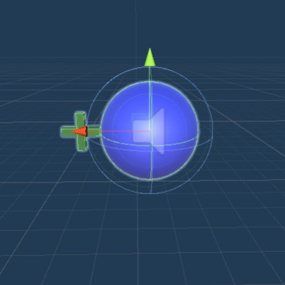

# VR Trefbal Handleiding

Chauvaux Nico, Collette Cédric, Messiaen Ruben, Van Nueten Wouter en Rahimi Halima

## Inleiding

Voor het vak VR Experience hebben wij als project gekozen om een VR Trefbal spel te maken. Bij dit spel is het de bedoeling dat de speler drie ontwijkers probeert te raken met een bal. Deze ontwijkers zijn AI's die we getraind hebben voor dit project.

## Samenvatting

Met deze handleiding geven wij stap voor stap uitleg hoe men van een leeg Unity project kan bekomen aan ons VR Trefbal spel. Er zal uitgelegd worden welke spelobjecten wij hebben aangemaakt, hoe deze zich kunnen gedragen in de spel omgeving en welke andere installaties er benodigd zijn.

## Methoden

### Installaties

Voor het spel werkende krijgen zijn er verschillende installaties vereist:

- Unity: 2019.4.10f1
- ML-Agents: 0.21.1
- Unity Oculus XR Plugin: 1.4.3
- Anaconda: 4.8.3

### Spelverloop

Bij het eerst inladen van de VR omgeving zal de speler zich bevinden in een sportzaal op een speelveld. De speler zal gecentreerd op een helft van dat speelveld staan. Aan de andere kant van het speelveld bevinden zich drie rode pion achtige firguren. Dit zijn de ontwijkers.

Het doel van het spel is dat de speler de ontwijkers uit schakelt met behulp van een ongelimiteerde hoeveelheid ballen die de speler kan gooien. Zolang de bal de ontwijker eerst raakt zal de ontwijker zijn uit geschakelt. Als de bal de grond eerst raakt en dan pas tegen de ontwijker telt dit dus niet mee. De ontwijkers zullen actief deze ballen proberen ontwijken. Zij hebben in tegenstelling tot de speler wel de vrijheid om zich te verplaatsen op hun zijde van het speelveld.

Tijdens het spel zullen er "power-ups" tevoorschijn komen. Deze power-ups bevinden zich op willekeurige plekken boven het veld. Als de speler een power-up kan raken door er een bal tegen te gooien zal de power-up voor een gelimiteerde tijd geactiveerd worden. Deze power-up zorgt er voor dat de ballen die speler kan gooien groter zijn dan normaal. Met deze power-up zal het dus makkelijker zijn om de ontwijkers te raken.

Het spel duurt maximaal 120 seconden. Als de speler binnen deze tijd de drie ontwijkers krijgt uitgeschakelt is het spel gewonnen. Als de tijd op is voor alle ontwijkers zijn uitgeschakelt is het spel verloren en moet de speler opnieuw beginnen.

### Observaties, acties en beloningen

#### Observaties

De ontwijker kan verscheidene dingen observeren in het speelveld. Dit zijn de verschillende observaties die de ontwijker kan hebben:

- PlayingGround: Het deel van het speelveld waar de ontwijkers op moeten blijven.
- Player: De ontwijker kan de speler zien, zodat hij weet waar de ballen vandaan komen.
- Ball: De ontwijker kan de ballen zien aankomen, waardoor hij deze kan ontwijken.
- Dodger: De ontwijkers kunnen ook elkaar zien, zodat ze kunnen vermijden dat ze tegen elkaar oplopen.
- Middleline: De ontwijkers kunnen de middenlijn zien, zodat ze zeker aan de juist kant van het speelveld staan.
- Ground: De ontwijkers kunnen de grond zien van de rest van het veld dat geen speelveld is, zodat ze kunnen vermijden daarop te lopen.

#### Acties

De ontwijker kan rondbewegen en springen, zodat hij de bal kan ontwijken. De speler zelf kan niet bewegen, maar kan wel de bal gooien naar de ontwijkers. De speler kan ook de bal gooien naar de power-ups om zo grotere ballen te krijgen.

#### Beloningen

De ontwijker krijgt verscheidene beloningen en straffen voor de acties die hij onderneemt tijdens het spelverloop:

- Geraakt door bal: - 0.5
- Raakt andere dodger aan: - 0.5
- Op het speelveld: + 0.01
- Buiten het speelveld van de ontwijkers: - 0.5

### Beschrijving objecten

#### Omgeving

Het speelveld is een zaal met tribunes en toeschouwers. De toeschouwers hebben geen invloed op het spel. Alleen de grond (rood), speelveld (groen) en de middenlijn die het speelveld verdeelt in twee delen (wit) zijn van belang voor de ontwijker.

#### Speler

De speler heeft op zich niet veel nut, maar wordt gebruikt bij de trainingen van de AI om zo het niet te laten lijken alsof de ballen zomaar uit het niets verschijnen.

#### Ontwijker

De ontwijker is het object waarop de AI zal worden toegepast. Deze zal aan de hand van de beschikbare acties, beloningen en observaties zo lang mogelijk proberen te overleven en de ballen te ontwijken.

#### Bal

De bal is het voorwerp dat de speler kan gooien om de ontwijkers en de power-ups te kunnen raken.

#### Power-up

De power-up zorgt ervoor dat de ballen die gegooid worden gedurende een korte tijd groter worden. Zo heeft de speler meer kans om de ontwijkers te raken.

### Beschrijving gedragingen van de objecten

#### Omgeving gedragingen

Het speelveld heeft dus geen speciale gedragingen. Het biedt alleen een visueel observatiepunt aan voor de ontwijker zodat deze zich kan oriënteren op het veld.

#### Speler gedragingen

Het object speler heeft geen gedragingen. De speler zelf in de VR-omgeving gaat de mogelijkheid hebben om de ballen te gooien naar de power-ups en de ontwijkers

#### Ontwijker gedragingen

Ontwijkers gaan aan de hand van het speelveld en de ballen zich zodanig proberen te manouvreren zodat ze de ballen kunnen ontwijken. Hoe langer ze zichzelf in leven kunnen houden, des te meer punten ze krijgen. Om te vermijden dat ze zichzelf groeperen en elkaar opofferen voor zichzelf, trekken we punten af als ze tegen elkaar opbotsen.

#### Bal gedragingen

De bal zorgt ervoor dat de ontwijkers van het speelveld gaan als deze een ontwijker raakt. Ook zorgt de bal ervoor dat de speler de power-ups kan raken zodat deze zijn ballen kan vergroten.

#### Power-up gedragingen

De power-ups verschijnen aan de kant van het speelveld van de tegenstanders. Deze power-ups verschijnen om de zoveel tijd en er kunnen er maximaal drie tegelijk zich bevinden op het speelveld.

### Informatie one-pager

Dit is de One-pager die we hebben ingediend bij het begin van dit project.

### Afwijking one-pager

Er staat in de one-pager dat de AI's niet hetzelfde reward-systeem gaan hebben. Dit is niet meer het geval, de drie AI's delen hetzelfde reward-systeem, zodat ze elkaar niet zouden tegenwerken.

## Resultaten

## Conclusie

Tijdens dit project hebben we dus een VR Trefbal game gemaakt met behulp van AI en VR.

*Kort overzicht resultaten overlopen (2-3 zinnen)*

*Persoonlijke visie op de resultaten, betekenis van de resultaten*

*Verbeteringen naar de toekomst toe*
